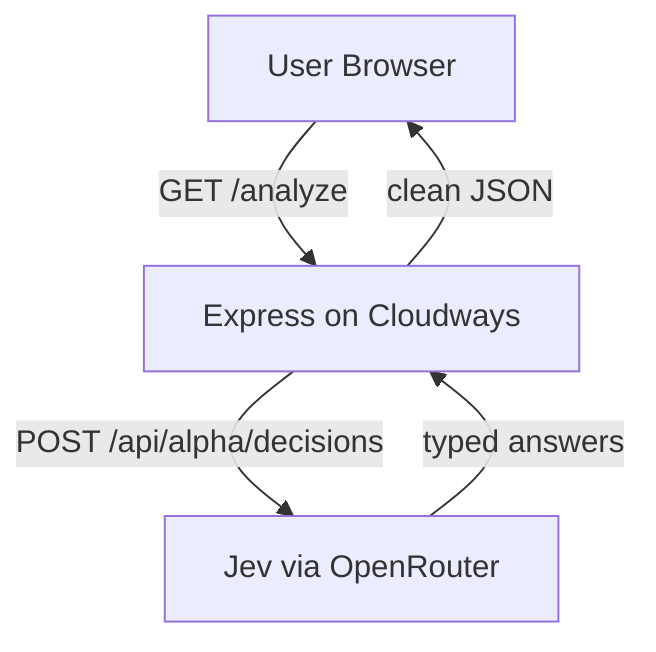

# Agency Request Triage — Jev on Cloudways Node.js Hosting

A reference Node.js application that proves a simple point: **you can run an AI-powered application on [Cloudways Managed Node.js Hosting](https://www.cloudways.com/en/velocity.php), using [Jev](https://openrouter.ai/docs/guides/community/jev) — a structured decision model — through the OpenRouter API.**

To test that out, we built a small sample app with Node.js and Express: paste a messy client request, and Jev instantly returns a structured decision — category, priority, assigned team, and whether to escalate.

Clone it, add your OpenRouter API key, deploy to Cloudways, and you have a working AI decision layer in under 30 minutes.

---

## Overview

Digital agencies receive dozens of unstructured client requests every day:

> "The checkout on our WooCommerce website stopped working."
> "Can you change the button color?"
> "The website is down and we have a campaign launching in two hours."

Each message needs to be categorized, prioritized, assigned to a team, and — in some cases — escalated. Doing this manually is slow and inconsistent.

This application lets a user paste a client request and immediately receive a structured analysis:

| Field | Example output |
|---|---|
| **Category** | Technical Issue |
| **Priority** | Critical |
| **Assigned Team** | Developer |
| **Escalation** | Yes |
| **Overall Confidence** | 100% |

The decisions are made by **Jev**, a structured decision model that returns typed, probability-weighted answers — not generated prose. This is not a chatbot: the typed output plugs directly into application logic. `priority === 'critical'` is something your code can branch on. A paragraph of generated text is not.

---

## What is Jev?

[Jev](https://openrouter.ai/docs/guides/community/jev) is TypeSafe's first "System One" model. Instead of generating text, it evaluates application state against typed questions and returns structured answers with calibrated probabilities.

Jev answers three kinds of question:

| Primitive | What it answers | Returns |
|---|---|---|
| **Choice** | Which one of these options? | Selected option + probability per option + confidence |
| **Noul** | Does this condition hold? | Probability of yes (0–1) |
| **Score** | Where does this fall on a scale? | Probability-weighted position + confidence |

This app uses three **Choice** questions (category, priority, team) and one **Noul** question (escalate?).

Jev is available via OpenRouter. You do **not** need a TypeSafe account — an [OpenRouter API key](https://openrouter.ai/settings/keys) is all you need. Requests are billed per input token to your OpenRouter account; output tokens are free. A triage request in this app costs about **$0.00003** — every response includes a `usage.cost` field showing the exact amount.

> The Decisions API is in beta. See the [Jev model page](https://openrouter.ai/typesafe/jev-1.13) for current pricing, limits, and status.

---

## Technology stack

The app is intentionally minimal so the Jev integration stays front and center:

| Layer | Technology | Why |
|---|---|---|
| Runtime | Node.js 18+ | Native `fetch()` — no HTTP client dependency needed |
| Backend | [Express](https://expressjs.com) | The most widely known Node.js web framework — one file, ~150 lines |
| Frontend | Vanilla HTML / CSS / JavaScript | No build step, no framework, nothing to compile |
| AI | Jev via the OpenRouter Decisions API | Structured decisions instead of generated text |
| Config | dotenv | Environment-variable configuration |
| Hosting | [Cloudways Managed Node.js Hosting](https://www.cloudways.com/en/velocity.php) | Git-based deployments, managed nginx + PM2, environment variable panel |

**Total production dependencies: 2** (`express`, `dotenv`).

Express does three jobs here:

1. **Serves the static frontend** (`public/` folder)
2. **Exposes one API route** — `GET /analyze` — which validates input, calls Jev, and returns clean JSON
3. **Keeps the API key server-side** — the browser never sees it

---

## Architecture

```
           User
             │
             ▼
   ┌─────────────────────┐
   │  Browser            │
   │  HTML + CSS + JS    │
   └────────┬────────────┘
            │  GET /analyze?message=...
            ▼
   ┌─────────────────────┐
   │  Node.js + Express  │  ← hosted on Cloudways
   │  src/server.js      │     (nginx + PM2, managed)
   └────────┬────────────┘
            │  POST /api/alpha/decisions
            │  Authorization: Bearer OPENROUTER_API_KEY
            ▼
   ┌──────────────────────┐
   │  Jev (OpenRouter)    │  ← external API
   │  ~typesafe/jev-latest│
   └────────┬─────────────┘
            │  Structured JSON
            │  { category, priority, team, escalate }
            ▼
   ┌─────────────────────┐
   │  Node.js + Express  │
   │  Parses + returns   │
   └────────┬────────────┘
            │  Clean JSON
            ▼
   ┌─────────────────────┐
   │  Browser            │
   │  Renders result     │
   └─────────────────────┘
```

**Cloudways hosts the Node.js application.** Jev is an external API. They are separate services.



---

## How the integration works

Everything lives in [`src/server.js`](src/server.js). The backend sends a `state` (the client message, with context) and four `questions` to Jev's Decisions API:

```
POST https://openrouter.ai/api/alpha/decisions
```

```json
{
  "model": "~typesafe/jev-latest",
  "state": "Client support request for a digital web agency: The checkout on our WooCommerce website stopped working...",
  "questions": {
    "category": {
      "type": "choice",
      "instructions": "What is the primary category of this client request?",
      "criteria": {
        "technical_issue": "Technical Issue - something on the site is broken or malfunctioning",
        "outage": "Outage - the site or a critical service is completely down",
        "design_change": "Design Change - visual or styling adjustments",
        "new_feature": "New Feature - new functionality to be built",
        "performance": "Performance - the site is slow or resource-heavy",
        "content_change": "Content Change - text, images, or copy updates",
        "other": "Other - anything that does not fit the above"
      }
    },
    "priority": {
      "type": "choice",
      "instructions": "What is the urgency of this client request? Consider business impact and deadlines.",
      "criteria": {
        "low": "Low - cosmetic or minor, no business impact",
        "medium": "Medium - should be handled soon but nothing is broken",
        "high": "High - significant impact or an approaching deadline",
        "critical": "Critical - revenue is being lost or a hard deadline is at risk"
      }
    },
    "team": {
      "type": "choice",
      "instructions": "Which team or role should handle this request?",
      "criteria": {
        "developer": "Developer - code, bugs, technical work",
        "designer": "Designer - visual design and styling",
        "content": "Content - copywriting and content updates",
        "project_manager": "Project Manager - planning, scoping, coordination"
      }
    },
    "escalate": {
      "type": "noul",
      "instructions": "Should this request be escalated to a senior team member? Escalate if critical, revenue-affecting, or deadline-driven."
    }
  }
}
```

> ⚠️ **Important format detail:** in a Choice question, `criteria` must be a **record (object)** mapping each option ID to a description — **not an array**. If you send an array of `{id, label}` objects, Jev rejects the request with `400: "Invalid input: expected record, received array"`. This is the single most common integration mistake.
>
> The descriptions also matter: richer criteria ("revenue is being lost or a hard deadline is at risk") give Jev more signal and produce noticeably better decisions than bare labels.

Jev returns typed answers keyed by question ID — no text to parse, no regex, no prompt-output cleanup:

```json
{
  "model": "typesafe/jev-1.13-20260917",
  "answers": {
    "category":  { "type": "choice", "choice": "technical_issue", "confidence": 0.99 },
    "priority":  { "type": "choice", "choice": "critical",        "confidence": 1.0  },
    "team":      { "type": "choice", "choice": "developer",       "confidence": 1.0  },
    "escalate":  { "type": "noul",   "noul": 0.94 }
  },
  "usage": { "input_tokens": 705, "output_tokens": 177, "cost": 0.00002961 },
  "provider": "TypeSafe"
}
```

The backend converts this into clean JSON for the frontend. One line captures the whole idea of the demo:

```js
escalate: { value: answers.escalate.noul >= 0.5, ... }
```

**An AI judgment used directly as application logic.** In a real system, this is where you'd trigger a Slack alert, assign a ticket, or page an on-call engineer.

The API key never leaves the server.

---

## Prerequisites

- **Node.js** 18 or later (`node -v` to check — native `fetch` requires 18+)
- **npm** (bundled with Node.js)
- **OpenRouter API key** — see Step 1 below
- **Git** and a **GitHub account**
- **Cloudways account** (only needed for deployment)

---

## Step 1 — Get an OpenRouter API key

Jev is accessed through OpenRouter. There is no separate TypeSafe signup.

1. Go to [openrouter.ai](https://openrouter.ai) and create a free account.
2. Open [openrouter.ai/settings/keys](https://openrouter.ai/settings/keys).
3. Click **Create Key**, give it a name (e.g. `agency-triage`), and copy the key — it starts with `sk-or-v1-`.
4. Add a small amount of credit at [openrouter.ai/settings/credits](https://openrouter.ai/settings/credits) — even $1 covers tens of thousands of triage requests.

> 🔒 This key must never appear in frontend code, in Git, or in any file you commit. It lives in exactly two places: your local `.env` file (which is gitignored) and the Cloudways Environment Variables panel.

---

## Step 2 — Run locally

```bash
# Clone
git clone https://github.com/cloudways/cloudways-jev-nodejs-demo.git
cd cloudways-jev-nodejs-demo

# Install dependencies (express + dotenv)
npm install

# Create your environment file
cp .env.example .env
```

Open `.env` and set your key:

```
OPENROUTER_API_KEY=sk-or-v1-xxxxxxxxxxxxxxxxxxxxxxxx
PORT=3000
```

> **Never commit `.env`.** It is already in `.gitignore`.

Start the server:

```bash
npm start
```

You should see:

```
Running on 0.0.0.0:3000
API key set: true
```

Open [http://localhost:3000](http://localhost:3000), click one of the example chips, and hit **Analyze Request**.

You can also hit the API directly:

```bash
curl "http://localhost:3000/analyze?message=The%20checkout%20stopped%20working"
```

```json
{
  "result": {
    "category":  { "id": "technical_issue", "label": "Technical Issue", "confidence": 99 },
    "priority":  { "id": "critical", "label": "Critical", "confidence": 100 },
    "team":      { "id": "developer", "label": "Developer", "confidence": 100 },
    "escalate":  { "value": true, "probability": 94 },
    "overallConfidence": 100
  },
  "usage": { "input_tokens": 705, "output_tokens": 177, "cost": 0.00002961 }
}
```

---

## Step 3 — Deploy to Cloudways

The steps below reflect the Cloudways Node.js hosting interface as tested with this app. Field names may evolve — check the [Cloudways documentation](https://support.cloudways.com) if something looks different.

### 3.1 Push this repo to your GitHub

Fork this repository, or create your own repo and push the code. A **private repo works fine** — Cloudways connects to it via GitHub authorization.

### 3.2 Create a Node.js application on Cloudways

1. Log in at [platform.cloudways.com](https://platform.cloudways.com).
2. Click **Add Server** (or use an existing one).
3. Under **Application**, select **Node.js**.
4. Name the app (e.g. `agency-triage`), pick a provider and server size — the smallest tier is plenty for this demo — and launch.

### 3.3 Connect your GitHub repository

1. Open your application → **Deployment Management** in the left sidebar.
2. Connect your GitHub account and select your repository.
3. Set the branch to **`main`**.
4. Enable **Auto-deployment** — every push to `main` will then deploy automatically.

### 3.4 Configure the build settings

Go to **Deployment Management → Settings** and set:

| Field | Value |
|---|---|
| Framework Preset | `Express` |
| Branch | `main` |
| Node version | `18` or newer |
| Root Directory | `./` |
| Package Manager | `npm` |
| **Entry File** | **`src/server.js`** |

Click **Save & Redeploy**.

> ⚠️ **Entry File is the setting that trips people up.** The default value is `npm run start`, but this field expects a **file path**. Set it to `src/server.js`.

### 3.5 Add your environment variable

1. In the left sidebar, open **Environment Variables**.
2. Click **+ Add Variable** and add exactly one variable:

| Key | Value |
|---|---|
| `OPENROUTER_API_KEY` | `sk-or-v1-...` (your key) |

3. Save.

> ⚠️ **Do not add a `PORT` variable on Cloudways.** The platform manages the port itself and injects it into the process. The app reads `process.env.PORT || 3000`, which works in both environments. Setting `PORT` manually can conflict with the platform's webserver configuration.

### 3.6 Deploy and verify

1. Go to **Deployment Management → Deployments** and click **Redeploy** (or just push to `main` if auto-deploy is on).
2. Wait for the ✅ **Success** status. The build log should end with:

```
[info] Application started with PM2 (process 'node-app', port 3000) and enabled on boot.
Status : SUCCESS
```

3. Verify the app is alive by opening the health endpoint in your browser:

```
https://your-app-url.cloudwaysnodeapps.com/health
```

You should see: `{"ok":true}`

4. Open the app URL itself, click an example chip, and hit **Analyze Request**. If you see the result cards, the full stack is working:

```
Browser → Express on Cloudways → Jev on OpenRouter → Express → Browser
```

---

## Step 4 — Test the application

Click each example chip, or paste your own client messages. Expected behavior:

| Test message | Category | Priority | Team | Escalate |
|---|---|---|---|---|
| "The checkout on our WooCommerce website stopped working. Customers can't complete their orders." | Technical Issue | Critical | Developer | **Yes** |
| "The client's website is completely down and they have a campaign launching in two hours." | Outage | Critical | Developer | **Yes** |
| "Can you change the button color on the homepage from blue to green?" | Design Change | Low | Designer | No |
| "The client wants us to add a booking form to the website." | New Feature | Medium | Developer / PM | No |
| "Several pages take more than 10 seconds to load." | Performance | High | Developer | Varies |

Also worth testing:

- **Empty input** → the Analyze button simply refocuses the textarea
- **A message over 4,000 characters** → friendly "message too long" error
- **API-level testing** → `GET /analyze?message=...` returns raw JSON; `GET /health` confirms the process is up

---

## Project structure

```
cloudways-jev-nodejs-demo/
│
├── public/
│   ├── index.html      ← Single-page frontend
│   ├── styles.css      ← All styles (dark SaaS-style dashboard)
│   └── app.js          ← Frontend logic (fetch, render)
│
├── src/
│   └── server.js       ← Express server + entire Jev integration
│
├── .env.example        ← Environment variable template
├── .gitignore          ← Excludes .env and node_modules
├── package.json        ← 2 dependencies: express, dotenv
├── LICENSE
└── README.md
```

The entire integration — questions, API call, response parsing, error handling — is one readable file: [`src/server.js`](src/server.js).

---

## Security notes

- **`OPENROUTER_API_KEY`** exists only in the server environment. It is read via `process.env` and never included in any HTTP response.
- **`.env`** is in `.gitignore` and must never be committed. Only `.env.example` (with a placeholder) is committed.
- **If a key is ever committed by accident** — even to a private repo — revoke it at [openrouter.ai/settings/keys](https://openrouter.ai/settings/keys), create a new one, and update it in Cloudways → Environment Variables.
- User input is validated for presence, type, and a 4,000-character limit before anything is sent to Jev.
- Server-side errors are logged without exposing secrets. The browser receives only a user-friendly message.

---

## Troubleshooting

Real issues, in the order you're most likely to hit them:

### `400 — "Invalid input: expected record, received array"` from Jev

Your `criteria` is an array. It must be an object: `{ option_id: 'description', ... }`. See [How the integration works](#how-the-integration-works). The same error appears as `expected record, received undefined` if a required field like `criteria` is missing entirely.

### The frontend shows `Unexpected token '<', "<!DOCTYPE"... is not valid JSON`

The browser called the API but received an HTML page instead of JSON. Causes, most common first:

1. **The Node.js process crashed or isn't running the current code** — check the deployment succeeded and hit `/health` to confirm the process is up.
2. **A stale cached `app.js` in the browser** — hard-refresh with `Ctrl+Shift+R`, or check in DevTools → Network which URL the frontend actually requested.
3. **Frontend and backend route mismatch** — the URL in `public/app.js` must match the route registered in `src/server.js`.

### `502 Bad Gateway`

The platform's proxy couldn't get a response from your Node.js process. Check in order:

1. **Is the process alive?** Open `/health`. If that also returns 502, the app is crash-looping — check the Cloudways application logs for the exception.
2. **Entry File setting** — must be `src/server.js`, not `npm run start`.
3. **An unhandled rejection is killing the process.** Wrap the entire request handler in `try/catch` (this repo's `server.js` already does). An async error outside a `try/catch` takes down the whole Node.js process, and every request after that returns 502 until PM2 restarts it.
4. **A `PORT` environment variable you added manually** — remove it and redeploy; Cloudways sets the port itself.

### `401 Unauthorized` from Jev

The key is missing, mistyped, or revoked. Verify it in Cloudways → Environment Variables (no leading/trailing spaces), then **Save & Redeploy** — environment variable changes require a redeploy to take effect.

### `429 Too Many Requests`

You've hit a rate limit. Wait a moment and retry. Current limits are listed on the [Jev model page](https://openrouter.ai/typesafe/jev-1.13).

### Deployment succeeds but old code still runs

GitHub file edits sometimes don't get committed fully (easy to miss the Commit button on multi-file edits). Verify the changed lines are actually visible in the repo on github.com, then check that a new deployment ran after that commit.

### App works locally but not on Cloudways

Almost always one of three things: Entry File not set to `src/server.js`, the `OPENROUTER_API_KEY` environment variable missing on Cloudways, or a manually-added `PORT` variable. Those three settings cover the platform-specific configuration completely.

---

## What this demo proves

1. **A Node.js/Express application runs on [Cloudways Managed Node.js Hosting](https://www.cloudways.com/en/velocity.php).**
2. **The application communicates with Jev through the OpenRouter Decisions API.**
3. **Jev turns unstructured text into structured, typed decisions.**
4. **Application code can branch on those decisions** — display them, route a ticket, trigger a workflow.
5. **Another developer can clone this repo, add an API key, deploy to Cloudways, and have it working in under 30 minutes.**

---

## Future extensions

This reference application is intentionally minimal. Possible next steps:

- **Act on the decisions** — when `escalate` is true, post to a Slack webhook or create a ticket. The typed output makes this a one-line `if`.
- **Add a Score question** — e.g. estimated effort on a `trivial → major-project` scale ([Score primitive docs](https://docs.typesafe.ai/primitives/score)).
- **Persist results** — add a database on the same Cloudways server and build a triage-history dashboard.
- **Batch mode** — pipe an email inbox or contact-form feed through `/analyze` and auto-label everything.
- **Confidence thresholds** — route decisions below, say, 70% confidence to a human instead of acting automatically ([reading confidence](https://docs.typesafe.ai/confidence)).
- **Add an AI agent** — use Jev as the decision gate inside a larger automated workflow.

---

## License

MIT — see [LICENSE](LICENSE).

---

## Links

- [Jev on OpenRouter](https://openrouter.ai/docs/guides/community/jev)
- [Decisions API reference](https://openrouter.ai/docs/api/api-reference/alphadecisions/submit-a-decisions-questions-and-answers-request)
- [Jev model page + pricing](https://openrouter.ai/typesafe/jev-1.13)
- [TypeSafe documentation](https://docs.typesafe.ai)
- [Cloudways Managed Node.js Hosting](https://www.cloudways.com/en/velocity.php)
- [OpenRouter API keys](https://openrouter.ai/settings/keys)

---

*Built by [Danish Naseer](https://www.linkedin.com/in/hdanishnaseer/)*
