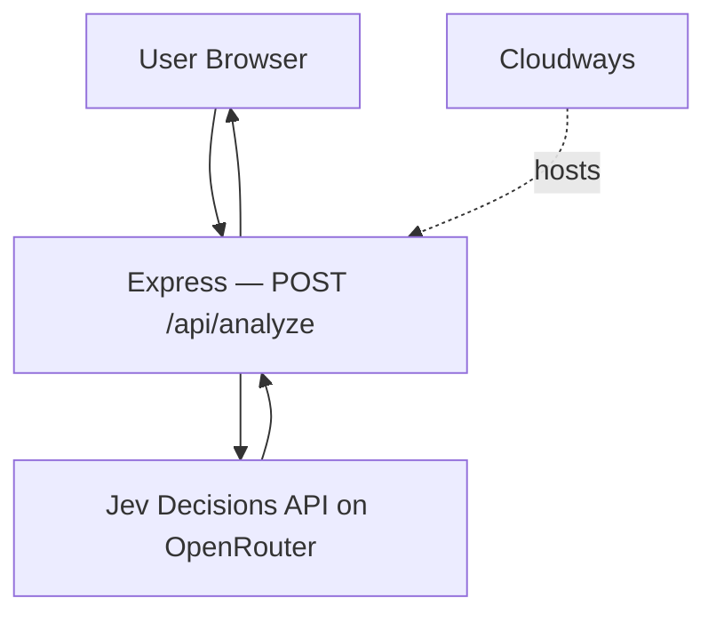

# Agency Request Triage

A reference Node.js application that demonstrates how to integrate **Jev** (the TypeSafe structured decision model) into a Node.js/Express application hosted on **Cloudways Managed Node.js Hosting**.

Built for developers who want to understand how to use Jev inside a real JavaScript application — not a chatbot, but a decision layer that turns unstructured text into typed, machine-readable answers.

---

## Overview

Digital agencies receive dozens of unstructured client requests every day:

> "The checkout on our WooCommerce website stopped working."
> "Can you change the button color?"
> "The website is down."

Each message needs to be categorized, prioritized, assigned to a team, and — in some cases — escalated. Doing this manually is slow and inconsistent.

This application lets a user paste a client request and immediately receive a structured analysis:

| Field | Example output |
|---|---|
| **Category** | Technical Issue |
| **Priority** | Critical |
| **Assigned Team** | Developer |
| **Escalation** | Yes |
| **Overall Confidence** | 91% |

The decisions are made by **Jev**, a structured decision model that returns typed, probability-weighted answers — not generated prose.

---

## What is Jev?

[Jev](https://openrouter.ai/docs/guides/community/jev) is TypeSafe's first "System One" model. Instead of generating text, it evaluates application state against typed questions and returns structured answers with calibrated probabilities.

Jev answers three kinds of question:

| Primitive | What it answers | Returns |
|---|---|---|
| **Choice** | Which one of these options? | Selected option + probability per option + confidence |
| **Noul** | Does this condition hold? | Probability of yes (0–1) |
| **Score** | Where does this fall on a scale? | Probability-weighted position + confidence |

Because the output is typed, your application code can branch on it directly. Jev does not produce explanations or reasoning traces — it produces decisions.

Jev is available via OpenRouter. You do **not** need a TypeSafe account — an [OpenRouter API key](https://openrouter.ai/settings/keys) is all you need.

> The Decisions API is in beta. See the [Jev model page](https://openrouter.ai/typesafe/jev-1.13) for current pricing, limits, and status.

---

## Architecture

```
           User
             │
             ▼
   ┌─────────────────────┐
   │  Browser            │
   │  HTML + CSS + JS    │
   └────────┬────────────┘
            │  POST /api/analyze
            ▼
   ┌─────────────────────┐
   │  Node.js + Express  │  ← hosted on Cloudways
   │  src/server.js      │
   └────────┬────────────┘
            │  POST /api/alpha/decisions
            │  Authorization: Bearer OPENROUTER_API_KEY
            ▼
   ┌─────────────────────┐
   │  Jev (OpenRouter)   │  ← external API
   │  ~typesafe/jev-latest│
   └────────┬────────────┘
            │  Structured JSON
            │  { category, priority, team, escalate }
            ▼
   ┌─────────────────────┐
   │  Node.js + Express  │
   │  Parses + returns   │
   └────────┬────────────┘
            │  JSON response
            ▼
   ┌─────────────────────┐
   │  Browser            │
   │  Renders result     │
   └─────────────────────┘
```

**Cloudways hosts the Node.js application.** Jev is an external API. They are separate services.



---

## How the integration works

The backend sends a `state` (the client message, with context) and four `questions` to Jev's Decisions API:

```
POST https://openrouter.ai/api/alpha/decisions
```

```json
{
  "model": "~typesafe/jev-latest",
  "state": "You are triaging a client support request for a digital web agency. The client has sent the following message:\n\nThe checkout on our WooCommerce website stopped working...",
  "questions": {
    "category": {
      "type": "choice",
      "instructions": "What is the primary category of this client request?",
      "options": [
        { "id": "technical_issue", "label": "Technical Issue" },
        { "id": "outage", "label": "Outage" },
        ...
      ]
    },
    "priority": {
      "type": "choice",
      "instructions": "What is the urgency of this client request?",
      "options": [
        { "id": "low", "label": "Low" },
        { "id": "critical", "label": "Critical" },
        ...
      ]
    },
    "team": {
      "type": "choice",
      "instructions": "Which team or role should handle this request?",
      "options": [...]
    },
    "escalate": {
      "type": "noul",
      "instructions": "Should this request be escalated to a senior team member?"
    }
  }
}
```

Jev returns:

```json
{
  "model": "typesafe/jev-1.13",
  "answers": {
    "category":  { "choice": "technical_issue", "confidence": 0.97, "probabilities": {...} },
    "priority":  { "choice": "critical",        "confidence": 0.95, "probabilities": {...} },
    "team":      { "choice": "developer",       "confidence": 0.93, "probabilities": {...} },
    "escalate":  { "noul": 0.91 }
  },
  "usage": { "input_tokens": 312, "output_tokens": 0, "cost": 0.000013 }
}
```

The Node.js backend parses this and returns clean JSON to the browser. **The API key never leaves the server.**

---

## Prerequisites

- **Node.js** 18 or later (`node -v` to check)
- **npm** (bundled with Node.js)
- **OpenRouter API key** — [get one free](https://openrouter.ai/settings/keys)
- **Git**
- **Cloudways account** (only needed for deployment)

---

## Run locally

### 1. Clone the repository

```bash
git clone https://github.com/cloudways/cloudways-jev-nodejs-demo.git
cd cloudways-jev-nodejs-demo
```

### 2. Install dependencies

```bash
npm install
```

### 3. Create your `.env` file

```bash
cp .env.example .env
```

Open `.env` and set your key:

```
OPENROUTER_API_KEY=sk-or-v1-xxxxxxxxxxxxxxxxxxxxxxxx
PORT=3000
```

> **Never commit `.env`.** It is already in `.gitignore`.

### 4. Start the server

```bash
npm start
```

### 5. Open the application

Open [http://localhost:3000](http://localhost:3000) in your browser.

---

## Get an OpenRouter API key

1. Go to [https://openrouter.ai/settings/keys](https://openrouter.ai/settings/keys).
2. Create a free account if you don't have one.
3. Click **Create key**.
4. Copy the key and paste it into your `.env` file as `OPENROUTER_API_KEY`.

Jev is billed to your OpenRouter account per input token. Output tokens are free. For current pricing, see the [Jev model page](https://openrouter.ai/typesafe/jev-1.13).

### Why the key must stay server-side

The `OPENROUTER_API_KEY` is only ever used in `src/server.js` via `process.env.OPENROUTER_API_KEY`. It is never included in any response, never sent to the browser, and never written to frontend files.

If you put the key in frontend JavaScript, it becomes visible to anyone who opens DevTools. Anyone with the key can make API calls billed to your account.

---

## Deploy to Cloudways

Cloudways Managed Node.js Hosting runs your Express application on managed infrastructure. The steps below reflect the Cloudways interface as of mid-2026 — check the [current Cloudways documentation](https://support.cloudways.com) if the UI has changed.

### 1. Create a Cloudways account

Go to [cloudways.com](https://www.cloudways.com) and sign up.

### 2. Create a new application

1. In the Cloudways console, click **Add Server** (or select an existing server).
2. Choose a cloud provider and server size.
3. Under **Application**, select **Node.js**.
4. Give the application a name (e.g., `agency-triage`).
5. Complete the server creation wizard.

### 3. Connect your GitHub repository

1. In your application's settings, find the **Git** or **Deployment** section.
2. Connect your GitHub account and select this repository.
3. Set the branch to deploy (usually `main`).

### 4. Configure the start command

In the Cloudways application settings, set the **Application Start Command** (sometimes called the entry point or startup command) to:

```
node src/server.js
```

Or, if Cloudways runs `npm start` automatically, verify that `package.json` has:

```json
"scripts": {
  "start": "node src/server.js"
}
```

> Consult the current [Cloudways Node.js documentation](https://support.cloudways.com) for the exact field name and format.

### 5. Configure environment variables

In the Cloudways application settings, add:

| Key | Value |
|---|---|
| `OPENROUTER_API_KEY` | Your OpenRouter key |
| `PORT` | Leave unset — Cloudways sets `PORT` automatically |

> Do not set `PORT` manually on Cloudways. The platform injects it. The application reads `process.env.PORT || 3000`, so it works in both environments.

### 6. Install dependencies and deploy

Cloudways typically runs `npm install` during deployment. If you need to trigger it manually, use the Cloudways SSH console:

```bash
cd /path/to/your/application
npm install --production
```

### 7. Start the application

In the Cloudways dashboard, click **Start** or **Deploy**. Once the deployment completes, click the application URL to open it.

### 8. Test

Paste a client request and click **Analyze Request**. If you see a structured result, the full stack is working:

```
Browser → Express on Cloudways → Jev on OpenRouter → Express → Browser
```

---

## Test the application

### Critical technical issue

> The checkout on our WooCommerce website stopped working. Customers can't complete their orders.

**Expected:** Category → Technical Issue, Priority → Critical, Escalation → Yes

### Site outage with deadline

> The client's website is completely down and they have a campaign launching in two hours.

**Expected:** Category → Outage, Priority → Critical, Escalation → Yes

### Low-priority design request

> Can you change the button color on the homepage from blue to green?

**Expected:** Category → Design Change, Priority → Low, Escalation → No

### New feature request

> The client wants us to add a booking form to the website so customers can schedule consultations.

**Expected:** Category → New Feature, Priority → Medium, Team → Developer or Project Manager

### Performance issue

> The website has become very slow and several pages take more than 10 seconds to load.

**Expected:** Category → Performance, Priority → High

---

## Troubleshooting

### "The server is not configured with an API key"

Your `OPENROUTER_API_KEY` environment variable is missing or still set to the placeholder value. Set it in `.env` (local) or in the Cloudways environment variables panel (production).

### "Invalid API key"

The key is present but rejected by OpenRouter. Check that you copied the full key from [openrouter.ai/settings/keys](https://openrouter.ai/settings/keys) and that the key has not been revoked.

### "Rate limit reached"

You have exceeded the Jev request rate limit. Wait a few seconds and try again. For production use, see [Jev's current limits](https://openrouter.ai/typesafe/jev-1.13).

### "Could not reach the decision API"

A network error occurred between your server and OpenRouter. Check:
- Your server has outbound HTTPS access (port 443).
- OpenRouter is reachable: `curl https://openrouter.ai/api/alpha/decisions`

### Application won't start on Cloudways

- Confirm the start command is `node src/server.js` (or that `npm start` is configured correctly).
- Check that `node_modules/` was installed (`npm install`).
- Check the Cloudways application logs for the exact error.
- Confirm your Node.js version is 18 or later. Cloudways lets you select the Node.js version in the application settings.

### Port conflicts

The application reads `process.env.PORT`. On Cloudways, this is set automatically. Locally, it defaults to 3000. Do not hard-code a port.

### CORS errors

This application serves the frontend from the same Express server that handles API requests, so CORS is not required. If you move the frontend to a separate host, add the `cors` npm package and configure it in `src/server.js`.

---

## Project structure

```
cloudways-jev-nodejs-demo/
│
├── public/
│   ├── index.html      ← Single-page frontend
│   ├── styles.css      ← All styles
│   └── app.js          ← Frontend logic (fetch, render)
│
├── src/
│   └── server.js       ← Express server + Jev integration
│
├── .env.example        ← Environment variable template
├── .gitignore
├── package.json
└── README.md
```

---

## Security notes

- **`OPENROUTER_API_KEY`** exists only in the server environment. It is read via `process.env` and never included in any HTTP response.
- **`.env`** is in `.gitignore` and must never be committed.
- User input is validated for length and type before being sent to Jev.
- Server-side errors are logged without exposing secrets. The browser receives only a user-friendly message.

---

## What this demo proves

1. **A Node.js/Express application runs on Cloudways Managed Node.js Hosting.**
2. **The application communicates with Jev through its Decisions API.**
3. **Jev turns unstructured text into structured, typed decisions.**
4. **Application code can branch on those decisions** — display them, route a ticket, trigger a workflow.
5. **Another developer can clone this repo, add an API key, deploy to Cloudways, and have it working in under 30 minutes.**

---

## Future extensions

This reference application is intentionally minimal. Possible next steps:

- **Persist results** to a database (e.g., PostgreSQL on the same Cloudways server).
- **Add a ticket queue** — store incoming requests and display them in a dashboard.
- **Integrate a notification** — send a Slack or email alert when `escalate` is true.
- **Add an AI agent** — use Jev as a decision gate inside an automated workflow.
- **Add confidence thresholds** — route low-confidence decisions to a human reviewer.

---

## License

MIT — see [LICENSE](LICENSE).

---

## Links

- [Jev on OpenRouter](https://openrouter.ai/docs/guides/community/jev)
- [Jev model page + pricing](https://openrouter.ai/typesafe/jev-1.13)
- [TypeSafe documentation](https://docs.typesafe.ai)
- [Cloudways Managed Node.js Hosting](https://www.cloudways.com)
- [OpenRouter API keys](https://openrouter.ai/settings/keys)
